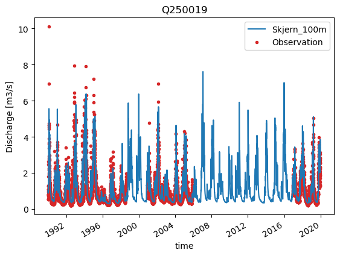
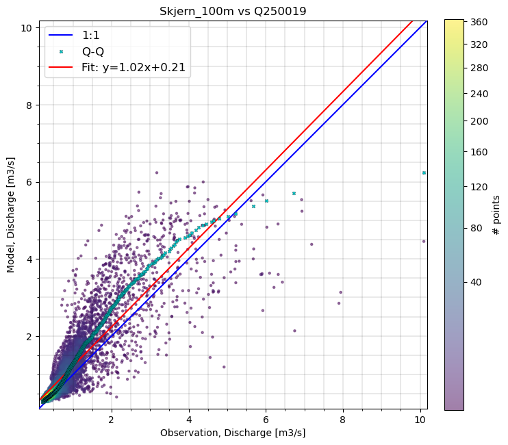

# Integrated Hydrological Model of Skjern Catchment
This README provides practical and background information on the dataset. The dataset can be cited as:

== Include citation after publishing ==

See the [license](license.txt) for details on data usage.

> ⚠️ **Important Disclaimer**    
> This model is **not calibrated** for operational use. It is intended for **educational and research purposes only**, and the results **must not** be used for decision-making. The performance shown here does **not** reflect that of DHI’s high-resolution models.


## Intended use

This dataset is designed to support educational, research, and exploratory activities, including:

* Experimenting with integrated hydrological modeling with MIKE SHE.
* Changing model parameters and running simulations with the MIKE SHE Python API.
* Validating model outputs with insitu and remote sensing observational data.
* Testing and comparing model parameter calibration methods.
* Exploring how model outputs change with plenty vs. limited calibration data.
* Building data-driven models, including machine learning surrogates of MIKE simulation results.


## Folder structure

**The repository is organized in the following way:**

- README.md
- license
- code
    + tutorial notebooks
- MapsDK
    + \* Sample input data (*.dfs2, *.dfs0)
    + Domain shapefiles (/DKDomains2013/*)
    + \* Geological layer data (/dkmj2019/*)
    + River discharge observations (/Qdata/*)
    + Well water table depth observations (/Hdata/*)
    + MIKE Hydro river cross sections (/Mhydro/*.xns11)
- Skjern_Models/Setup
    + MIKE SHE model (.she)
    + MIKE Hydro model (.myhdro)
    + \* Model setup data (*.dfs2)
    + \* Results folder (/HIP_500m_Skjern_DHI.she - Result Files/)
- waterbalance_output
    + Output data files from water balance post processing (*.dfs0, *.txt)
    + Output figure from water balance post processing (.emf)
- MS
    + Example surface water masks of the Skjern catchment derived from Sentinel-2 multispectral imagery (*.tiff)

> \* This repo does not contain all files needed for running the Skjern MIKE SHE model due to large file size. The example data and notebooks here are meant to help the user navigate input files, output files, how to adjust model parameters and validation of the model. To run the model, the complete folder of setup and input files should be downloaded from Zenodo :construction:

**In Zenodo:**
- MapsDK.zip
    + Contains complete folders for model inputs (MapsDK) and setup (Skjern_Models)

:exclamation: :exclamation: ***The MapsDK.zip file should be downloaded and extracted, where the folders MapsDK and Skjern_Models are placed in the main WATERBENCH-MIKESHE-SKJERN directory. These contain the remaining input files needed for simulation and full use of the model.***

## Introduction
This repository contains an example model setup of a MIKE SHE Integrated Hydrological Model for the Skjern River catchment located on the west coast of Jutland, Denmark. MIKE SHE models the flow of water through the major pathways in the terrestrial water cycle, with modules for overland flow, unsaturated zone, saturated zone, and land use. The model also utilizes the network of rivers, lakes and sewers as defined by a [MIKE Hydro Basin](https://www.dhigroup.com/technologies/mikepoweredbydhi/mike-hydro-basin) model setup. MIKE SHE models can be used for tasks such as catchment or subcatchment scale water resource assessment, analyses of surface and groundwater interactions, predicting flooding events, or simulating the effect of changes to land cover or climate on terrestrial water processes.

The repository includes:
- MIKE SHE model file, setup files, input data, observation data
- Model output
- Jupyter notebook guides

The Skjern MIKE SHE model is defined on 500 m grid cells for the period 1/2/1990 to 12/23/2019. Since there is no hot start included, it is recommended that the first several days of the simulation be discarded before analysis.

## MIKE SHE Integrated Hydrological Model


## Model validation

The [ModelSkill Python package](https://dhi.github.io/modelskill/) developed at DHI can be used to validate model outputs by comparing them to observational data. Example usage of this package can be found in the example model validation notebook, found at ```code/model_validation.ipynb```.

In situ data for model validation include river gauges and water table depth wells. The river gauge data can be downloaded from -----. The well data can be downloaded from the National well database (Jupiter) hosted by the Geologic Survey of Denmark (GEUS) [here]{https://eng.geus.dk/products-services-facilities/data-and-maps/national-well-database-jupiter}. Available timeseries for the model simulation period are stored here as dfs0 files, in the folders MapsDK/Qdata/ and MapsDK/Hdata for river discharge and well timeseries, respectively. The location of the measurement stations are shown below:


An example comparison of modeled and observed timeseries for on of the river gauges in Skjern catchment is shown below, both as a direct timeseries comparison and a scatter plot of modeled vs. observed discharge. More plots like this can be generated for any of the river and well stations in the model validation notebook, found at ```code/model_validation.ipynb```.






## Data sources

| Data          | Source     | Citation | License | 
| --------      | -------    | -------  | ------- |
| River Gauge   | ?          | ?        | ?       |
| Well          | ?          | ?        | ?       |
| Climate forcings     | DMI, DK model (GEUS)   |  ?    | ?    |
| Land use, Overland flow, Unsaturated flow, and Saturated zone inputs  | DK model (GEUS)   |  ?    | ?    |


## Dependencies

To run the tutorials and fully explore this waterbench case, the following packages are required:

The user can clone the required packages from the requirements.yaml or requirements.txt files.

With conda:
```
conda env create -f requirements.yml
conda activate waterbench_skjern
```