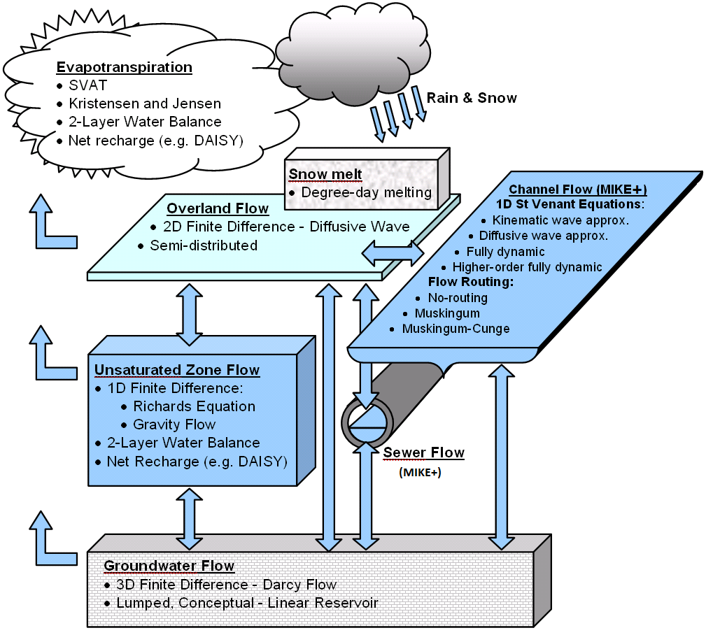
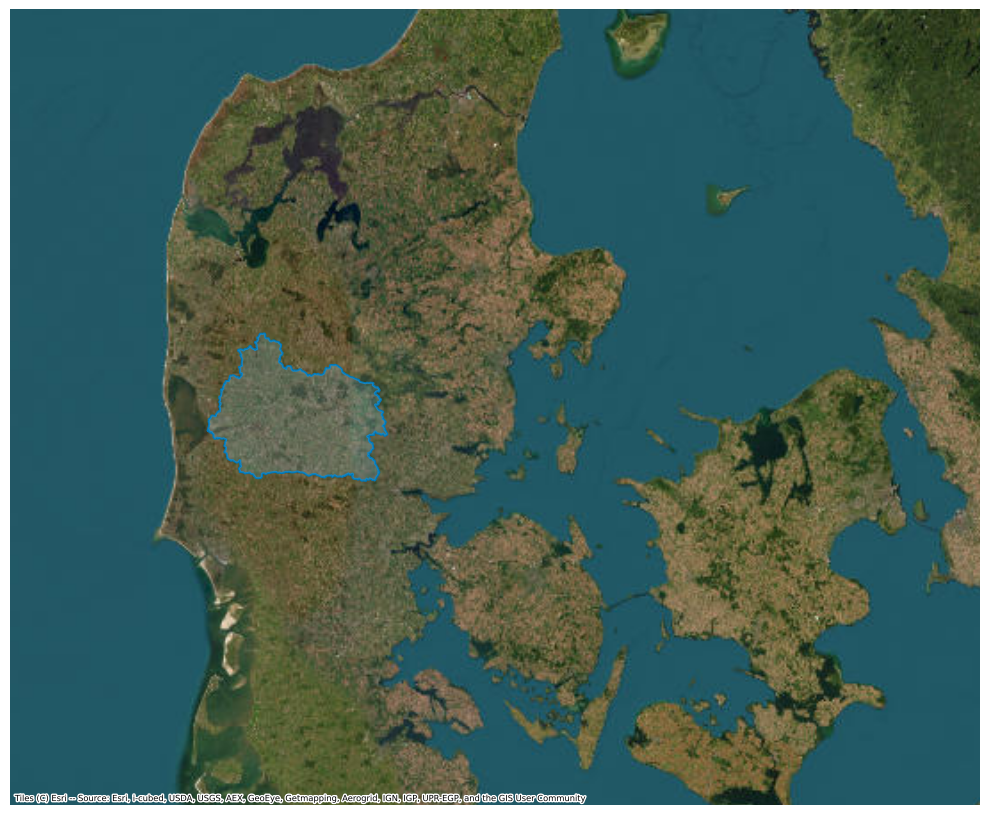

# Integrated Hydrological Model of Skjern Å Catchment
This README provides practical and background information on the dataset. The dataset can be cited as:

== Include citation after publishing ==

See the [license](license.txt) for details on data usage.

> ⚠️ **Important Disclaimer**    
> This model is **not calibrated** for operational use. It is intended for **educational and research purposes only**, and the results **must not** be used for decision-making. The performance shown here does **not** reflect that of DHI’s high-resolution models.


## Intended use

This dataset is designed to support educational, research, and exploratory activities, including:

* Experimenting with integrated hydrological modeling with MIKE SHE.
* Validating model outputs with insitu and remote sensing observational data.
* Testing and comparing model parameter calibration methods.
* Exploring how model outputs change with plenty vs. limited calibration data.
* Building data-driven models, including machine learning surrogates of MIKE simulation results.


## Folder structure

**The repository is organized in the following way:**

- README.md
- model
    + MIKE SHE model (.she)
- \* input
    + Input data (*.dfs2, *.dfs0) for modules:
        + climate
        + domain
        + land use
        + overland (Only at Zenodo)
        + rivers, lakes and sewers
        + topography
        + saturated zone (Only at Zenodo)
        + unsaturated zone (Only at Zenodo)
- observations
    + River discharge observations (Q_data)
    + Well water table depth observations (H_data)
- output sample
    + \* MIKE SHE output files
    + Waterbalance post processing output
- code
    + tutorial notebooks
- license
- requirements.yml

> \* This repo does not contain all files needed for running the Skjern MIKE SHE model due to large file size, particularly in the folders with * above. The example data and notebooks here are meant to help the user navigate input files, output files, and validation of the model. To run the model, the complete folder of setup and input files should be downloaded from Zenodo :construction:

## Introduction
This repository contains an example model setup of a MIKE SHE Integrated Hydrological Model for the Skjern River catchment located on the west coast of Jutland, Denmark. MIKE SHE models the flow of water through the major pathways in the terrestrial water cycle. The model also utilizes the network of rivers, lakes and sewers as defined by a [MIKE Hydro Basin](https://www.dhigroup.com/technologies/mikepoweredbydhi/mike-hydro-basin) model setup.

The repository includes:
- MIKE SHE model file, input data, observation data
- Model output
- Jupyter notebook guides


## MIKE SHE Integrated Hydrological Model

MIKE SHE is an integrated hydrological modeling system that emerged in the 1980s to represent the physical processes of water flow through the hydrological cycle in a modular way and with relevant scale. The available process modules - evapotranspiration, overland flow, unsaturated zone flow, groundwater flow, channel flow - are each governed by their relevant partial differential equations describing the movement of water through their system. Modules can be represented with more conceptual or lumped alternatives, giving the user the ability to tailor model complexity and compute time for their application. The model also has flexibliity in the spatial and temporal discretization, allowing process modules to have the grid size and time step appropriate for the modeling goals and data availability. Typical applications (among many others) for a MIKE SHE model include:
 
- Water resouce management for a river basin
- Flood modeling and prediction
- Wetland restoration and management
- Surface and groundwater interaction analyses
- Land change effects on basin hydrology
- Climate change effects on basin hydrology
- Groundwater withdrawal management
- Agriculture impact
- Irrigation management

A schematic of the MIKE SHE modules is shown below.


*Modules for different processes in MIKE SHE with their options for numerical engines. Arrows indicate how different modules interact. This figure is taken from the MIKE SHE user guide and reference manual, found [here](https://userdoc.mikeshe.mikepoweredbydhi.com/).*

A MIKE simulation can be run using the [MIKE modeling software](https://www.dhigroup.com/technologies/mikepoweredbydhi), provided that the appropriate input data and setup files are included. Although input and setup files depend on which modules are included and what numerical engines for these models are chosen, basic inputs include:

- Model domain 
- Topography (DEM)
- Precipitation timeseries

Detailed information on what inputs are required when different modules are added can be found in the [MIKE SHE user guide and reference manual](https://userdoc.mikeshe.mikepoweredbydhi.com/).

### The Skjern MIKE SHE setup


*Outline of Skjern catchment on the western coast of Denmark.*

The Skjern MIKE SHE model is defined on 500 m grid cells for the period 1/2/1990 to 12/23/2019. Since there is no hot start included, it is recommended that the first several days of the simulation be discarded before analysis. The model setup here was built by the Geologic Survey of Denmark (GEUS) and includes modules for overland flow (finite difference), unsaturated zone flow (2 layer), evapotranspiration (2 layer), saturated zone flow (finite difference), channel flow (higher-order fully dynamic Saint-Venant equations), and irrigation. Input files include climate timeseries, vegetation maps, irrigation demand, channel network, river cross section morphology, among others. A more detailed list of input files can be found in ```code/explore_input_data.ipynb```. 

The model takes approximately 0.4 hours to run in the provided state. Model outputs include simulated overland flow, groundwater flow, evapotranspiration, water table depth, and river discharge. Additional post-processing of the output files using the MIKE [Water Balance Tool](https://doc.mikepoweredbydhi.help/webhelp/2025/mikeshe/MIKE_SHE_online/Water_Balance/Using_the_Water_Balance_Tool.htm) can provide a breakdown of water storages by component (fx. irrigation, groundwater, overland water, etc.) for the full simulation timeseries. More detail on MIKE SHE output files and how to view them is shown in ```code/view_mikeshe_results.ipynb```.


## Model validation

The [ModelSkill Python package](https://dhi.github.io/modelskill/) developed at DHI can be used to validate model outputs by comparing them to observational data. Example usage of this package can be found in the example model validation notebook, found at ```code/model_validation.ipynb```.

In situ data for model validation include river gauges and water table depth wells. Available timeseries for the model simulation period are stored here as dfs0 files, in the folders MapsDK/Qdata/ and MapsDK/Hdata for river discharge and well timeseries, respectively. The location of the measurement stations are shown below:


An example comparison of modeled and observed timeseries for one of the river gauges in Skjern catchment is shown below, both as a direct timeseries comparison and a scatter plot of modeled vs. observed discharge. More plots like this can be generated for any of the river or well stations in the model validation notebook, found at ```code/model_validation.ipynb```.


## Data sources

The data used in this folder come from several sources.

| Data          | Source     | Citation | License | 
| --------      | -------    | -------  | ------- |
| River Gauge   | ?          | ?        | ?       |
| Well          | GEUS     | GEUS, *National well database (Jupiter)*, https://eng.geus.dk/products-services-facilities/data-and-maps/national-well-database-jupiter        | [Terms of use](https://data.geus.dk/geusmap/terms_20140620.pdf)      |
| Climate forcings     | DMI, DK model (GEUS)   |  ?    | ?    |
| Land use, Overland flow, Unsaturated flow, and Saturated zone inputs  | DK model (GEUS)   |  ?    | ?    |


## Dependencies

To run the tutorials and fully explore this waterbench case, the following packages are required:

The user can clone the required packages from the requirements.yaml or requirements.txt files.

With conda:
```
conda env create -f requirements.yml
conda activate waterbench_skjern
```